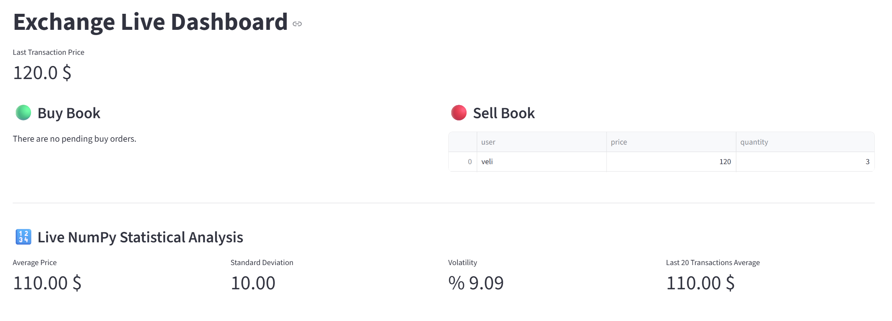
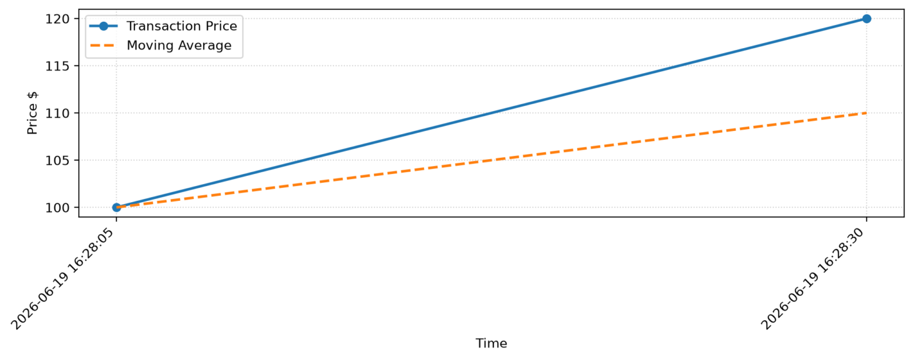
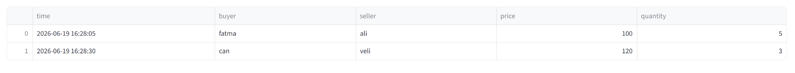

# Real-Time Multi-User Stock Exchange Order Book Simulation

An asynchronous, real-time cryptocurrency and stock exchange order book matching engine simulation built with Python. The system utilizes WebSockets for multi-user client-server communication, processes matching logic in real-time, stores transaction histories using Pandas, and visualizes live market data via a Streamlit dashboard accompanied by dynamic Matplotlib charts.

---

## 🚀 Key Features

* **Live WebSocket Architecture:** Asynchronous full-duplex communication infrastructure handles multiple client connections seamlessly.
* **Order Book & Matching Engine:** Implements structural matching logic where the highest buy order meets the lowest sell order ($Price_{Buy} \ge Price_{Sell}$).
* **Real-Time Data Streams:** Broadcasts immediate order book updates and matched trade details to all connected live instances.
* **Live NumPy Statistical Analysis:** Dynamically tracks system metrics including *Average Price*, *Standard Deviation*, *Volatility*, and *Moving Averages*.
* **Interactive Dashboard:** Beautiful user interface featuring synchronized order books, dynamic tabular trade logs, and continuous data visualization.
* **Persistent Storage:** Seamlessly logs executed transactions into a structured CSV file format via Pandas.

---

## 🛠️ Tech Stack & Dependencies

* **Language:** Python 3.10+
* **Asynchronous Framework:** `asyncio`, `websockets`
* **Data Processing & Analytics:** `pandas`, `numpy`
* **Visualization & UI:** `streamlit`, `matplotlib`

---

## 💻 UI & Dashboard Visuals

### Live Exchange Dashboard
The main control panel showcases active bids/asks along with a real-time statistical performance overview powered by NumPy metrics.



### Real-Time Market Trends
Matplotlib visualization maps the transaction prices alongside a dynamic moving average line to observe market trends.



### Persistent Data Log (CSV Schema)
All successful match executions generate clean immutable lines within our localized filesystem.



---

## 📂 Project Structure

```text
websocket-orderbook-project/
│
├── server.py             # Asynchronous WebSocket Server & Matching Engine
├── client_trader.py      # CLI Client for Submitting Buy/Sell Orders
├── live_dashboard.py     # Streamlit Live Visual Dashboard
├── orders.csv            # Persistent Database for Executed Trades
└── requirements.txt      # Project Dependencies File
